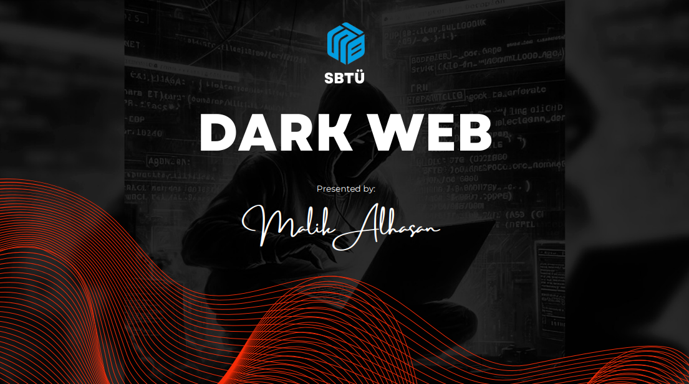
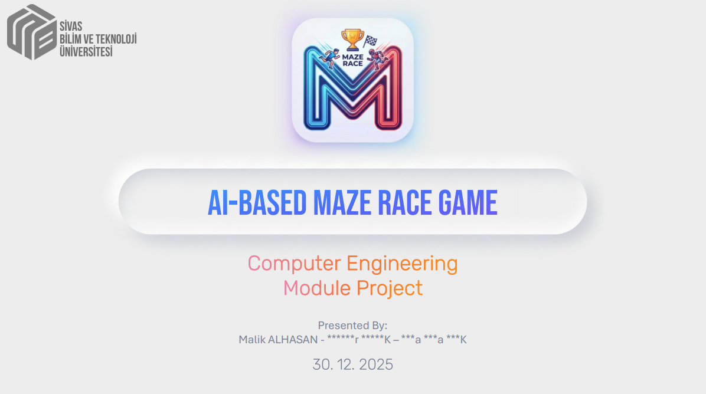
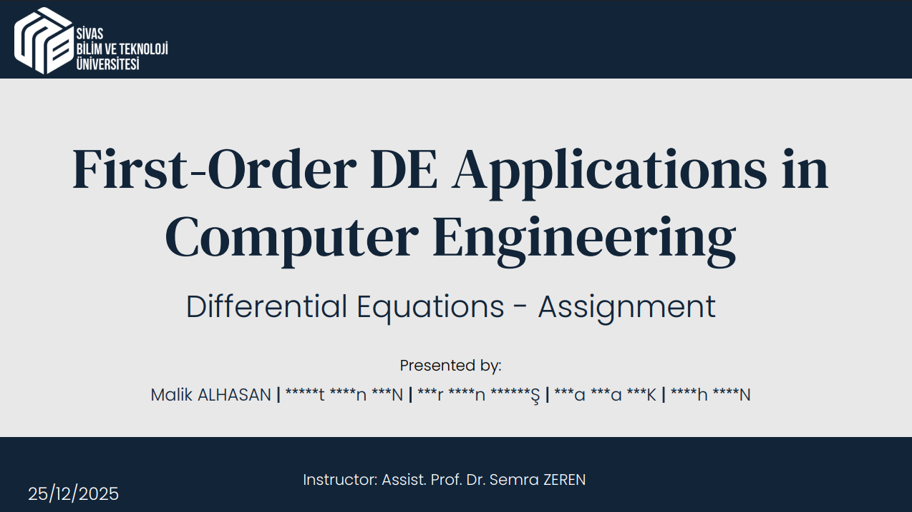
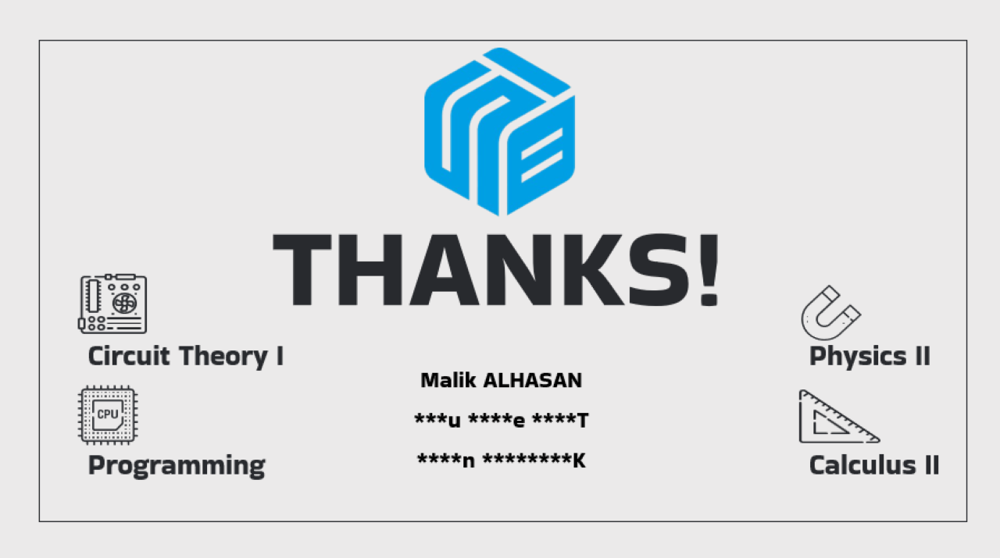
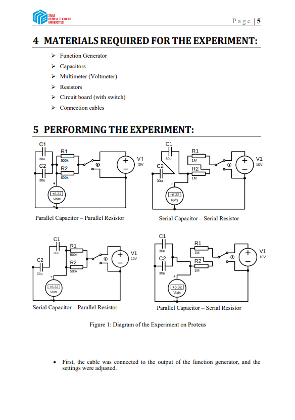
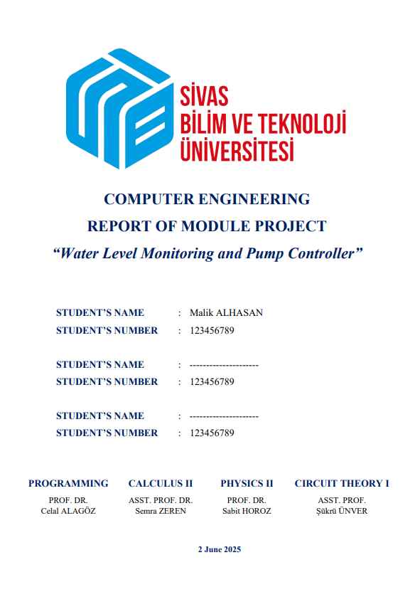
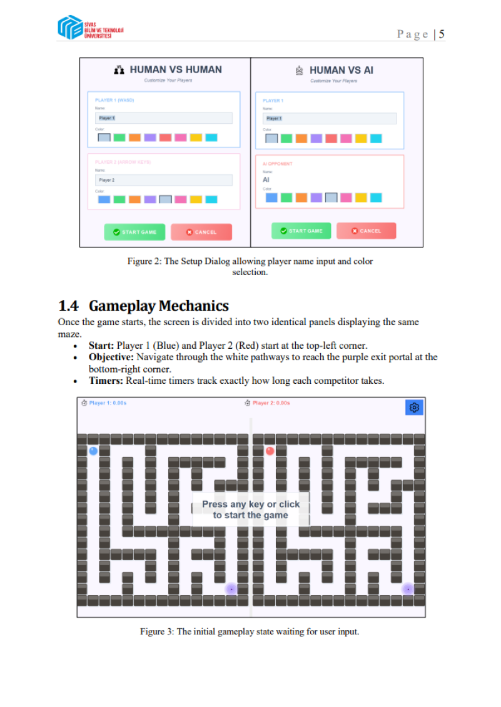

# 📊 Microsoft Office Professional Portfolio

A professional portfolio highlighting advanced layout design, structural formatting, and high-quality visual communication standards across Microsoft Word and PowerPoint.
### 🖼️ Visual Showcase

Click on any preview to view the full document.

| Presentation 1 | Presentation 2 |
| :---: | :---: |
|  |  |
| *Visual Design & Information Hierarchy* | *Technical Documentation & UML* |

| Presentation 3 | Presentation 4 |
| :---: | :---: |
|  |  |
| *Mathematical Modeling & Logic* | *Hardware-Software Integration* |

### 📝 Word Reports (Structured Layouts)

| Document 1 | Document 2 | Document 3 |
| :---: | :---: | :---: |
|  |  |  |
| *Academic Lab Formatting* | *Engineering Report Design* | *Software Architecture Layout* |

---

## 🎯 Objective
This repository is designed to demonstrate my ability to organize, format, and present complex information. While the documents herein cover various technical and academic subjects, the **primary focus of this portfolio is the structural and visual design** achieved using MS Office tools. It highlights my capacity to maintain high-quality documentation standards, visual hierarchy, and clean layouts regardless of the underlying topic.

## 🛠️ Demonstrated Skills

### **Microsoft Word (Technical & Academic Reporting)**
* **Structured Formatting:** Implementation of consistent Heading Styles for automated, multi-level Table of Contents generation.
* **Layout & Alignment:** Precise control over margins, spacing, and page breaks for optimal readability.
* **Data Presentation:** Professional formatting of tables, equations, and integrated figures/images.
* **Academic Standards:** Adherence to formal reporting structures, including customized cover pages and clean typography.

### **Microsoft PowerPoint (Visual Communication)**
* **Visual Hierarchy:** Strategic use of typography, color palettes, and spacing to guide the viewer's eye and emphasize key points.
* **Slide Deck Design:** Consistent layout creation across diverse themes (from Dark Theme modern presentations to corporate-style academic pitches).
* **Information Synthesis:** Transforming dense text paragraphs into digestible visual bullet points, icons, and structured diagrams.
* **Professional Exporting:** High-quality PDF rendering for seamless, cross-platform viewing without formatting loss.

---

## 🗃️ Source Files
To verify the native formatting techniques, applied styles, and raw layouts used to create these documents, the original editable `.docx` and `.pptx` files are available in the [Sources](./Sources/) directory.
